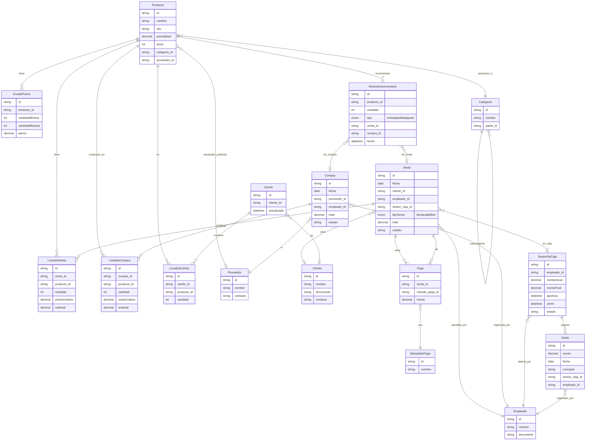

# Diagrama Entidad-Relación: Sistema de Inventario y Punto de Venta

Documentación del modelo de datos para el sistema de inventario y punto de venta. Incluye entidades base, entidades para las funcionalidades requeridas y el diagrama ER en Mermaid.

---

## 1. Entidades base

| Entidad             | Rol en el sistema                                                                           |
| ------------------- | ------------------------------------------------------------------------------------------- |
| **Productos**       | Artículos a vender/comprar; tienen precio base, stock, categoría y opcionalmente proveedor. |
| **Clientes**        | Quienes compran; opcionales en ventas (venta mostrador).                                    |
| **Proveedores**     | Origen de las compras; un producto puede tener proveedor preferido.                         |
| **Categorías**      | Clasificación de productos (jerárquica opcional: padre/hijo).                               |
| **Empleados**       | Quienes abren caja, realizan ventas, registran compras y gastos.                            |
| **Métodos de pago** | Efectivo, tarjeta, transferencia, etc.; se usan en ventas y en movimientos de caja.         |

---

## 2. Entidades adicionales para las funcionalidades

Para **registrar ventas**, **compras**, **aperturas/cierres de caja**, **precios por cantidad**, **ventas declaradas/libres**, **gastos** y **carrito**:

- **Venta** — Cabecera de cada venta: fecha, cliente (opcional), empleado, sesión de caja, tipo (declarada/libre), total, estado.
- **Línea de venta** — Detalle: producto, cantidad, precio unitario, subtotal; varias líneas por venta.
- **Compra** — Cabecera de cada compra: fecha, proveedor, empleado, total, estado.
- **Línea de compra** — Detalle: producto, cantidad, costo unitario, subtotal.
- **Sesión de caja** — Una apertura y un cierre: empleado, monto inicial, monto final, fecha/hora apertura y cierre. Las ventas y gastos pueden asociarse a una sesión.
- **Pago (Detalle de pago)** — Para ventas con varios métodos: venta, método de pago, monto. Relación N:M entre Venta y Métodos de pago con monto.
- **Escala de precio (Precio por cantidad)** — Por producto: cantidad mínima (y opcional máxima) y precio o descuento aplicable.
- **Gasto** — Monto, fecha, concepto, sesión de caja (opcional), empleado; opcionalmente categoría de gasto.
- **Carrito** — Cabecera del carrito: puede ser anónimo (sesión) o asociado a cliente; fecha de creación/actualización.
- **Línea de carrito** — Producto, cantidad; varias líneas por carrito.

**Opcional (recomendado para inventario):**

- **Movimiento de inventario** — Producto, cantidad (+/-), tipo (entrada/salida/ajuste), referencia (venta, compra o manual), fecha. Permite historial y conciliación; el stock puede derivarse de la suma de movimientos o mantenerse como campo calculado/actualizado.

---

## 3. Relaciones resumidas

- **Productos** → Categoría (N:1), opcionalmente Proveedor (N:1).
- **Venta** → Cliente (0:1), Empleado (1), Sesión de caja (0:1). **Línea de venta** → Venta (N:1), Producto (N:1).
- **Compra** → Proveedor (1), Empleado (1). **Línea de compra** → Compra (N:1), Producto (N:1).
- **Sesión de caja** → Empleado (1). Gastos y Ventas pueden referenciar Sesión de caja.
- **Pago** → Venta (N:1), Método de pago (N:1), monto.
- **Escala de precio** → Producto (N:1); atributos: cantidad mínima (y opcional máxima), precio o % descuento.
- **Gasto** → Sesión de caja (0:1), Empleado (1); opcionalmente Categoría de gasto.
- **Carrito** → Cliente (0:1). **Línea de carrito** → Carrito (N:1), Producto (N:1).
- **Movimiento de inventario** (opcional) → Producto (N:1); referencia opcional a Venta, Compra o manual.

Para "declarar ventas / ventas libres": un atributo en **Venta** (por ejemplo `tipoVenta: 'declarada' | 'libre'` o `declarada: boolean`) según normativa local.

---

## 4. Diagrama entidad-relación (Mermaid)

---

## 5. Decisiones de diseño

- **Venta declarada vs libre**: Campo en `Venta` (ej. `tipoVenta` o `declarada`). No hace falta entidad extra.
- **Precios por cantidad**: Entidad `EscalaPrecio` (o `PrecioPorCantidad`) por producto; al registrar la venta se calcula el precio aplicable según la cantidad (y opcionalmente se guarda en `LineaDeVenta.precioUnitario`).
- **Carrito**: Si solo es durante la sesión, `Carrito` puede no llevar `cliente_id` y identificarse por sesión/token. Si quieres carritos guardados, `cliente_id` opcional y tal vez `expiracion`.
- **Inventario**: Mantener `Producto.stock` actualizado desde compras y ventas (y ajustes). Opcional: entidad `MovimientoInventario` para trazabilidad y auditoría.
- **Caja**: Una `SesionDeCaja` por turno; las ventas y gastos pueden ligarse a esa sesión para reportes por caja y arqueo.

---

## 6. Resumen por funcionalidad

| Funcionalidad                   | Entidades principales                 |
| ------------------------------- | ------------------------------------- |
| Registrar ventas                | Venta, LineaDeVenta, Pago             |
| Registrar compras               | Compra, LineaDeCompra                 |
| Aperturas/cierres de caja       | SesionDeCaja                          |
| Precios por cantidad            | EscalaPrecio (relacionada a Producto) |
| Declarar ventas / ventas libres | Atributo en Venta                     |
| Gastos                          | Gasto (y opcionalmente SesionDeCaja)  |
| Carrito de compras              | Carrito, LineaDeCarrito               |
| Trazabilidad de inventario      | MovimientoInventario (opcional)       |

---

Este diagrama y estas entidades son la base para implementar el modelo en Payload CMS (collections) y MongoDB: cada entidad se mapea a una collection y las relaciones a `relationship` o referencias por `id`.
